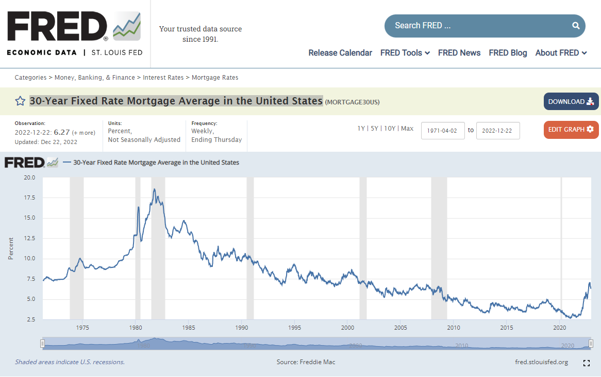
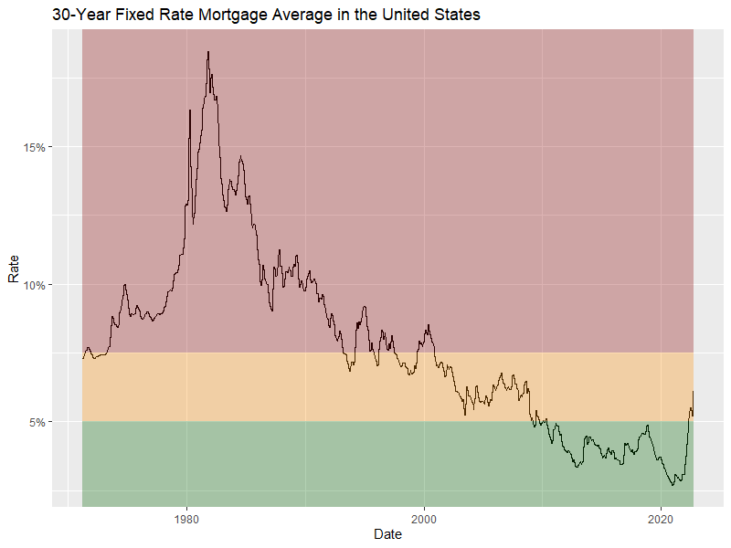

# Federal Reserve Economic Data EDA

The objective of this project was to extract data directly from FRED, wrangle the data, and visualize it with target bands.

## FRED Website

## Visual

### Citation
>Freddie Mac, 30-Year Fixed Rate Mortgage Average in the United States [MORTGAGE30US], retrieved from FRED, Federal Reserve Bank of St. Louis; https://fred.stlouisfed.org/series/MORTGAGE30US, December 27, 2022.
